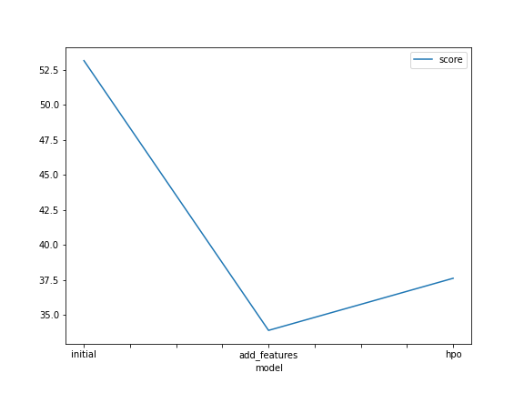

# Report: Predict Bike Sharing Demand with AutoGluon Solution
#### Anushka Srivastava

## Initial Training
### What did you realize when you tried to submit your predictions? What changes were needed to the output of the predictor to submit your results?
There were a total of three submissions done:
1) Initial Submission
2) Submission after adding new features
3) Submission after hyperparameter optimization

The Kaggle score went from 1.79888 to 0.46648 to 0.55394.

<b>Observation</b>: Before submitting the predictions to Kaggle, there were a few negative values found. In the first submission, there were none. In the second submission, there were 9 negative values and in the last submission, there were 116 negative values.

<b>Changes made</b>: Since Kaggle doesn't accept negative values, all these negative values were changed to 0 by iterating through the predictions.

### What was the top ranked model that performed?
The top ranked model that performed was the `add_features model` named `WeightedEnsemble_L3` with a Kaggle score of `0.46648` and RMSE score of `33.903188`.

## Exploratory data analysis and feature creation
### What did the exploratory analysis find and how did you add additional features?
- Initially, the dataset had a `datetime` feature and the `season` and `weather` were read as integers.
- This is visible in the initial graph that was created on the train dataset.
- To find additional features, we extracted year, month, day of the week and hour information from the train dataset and test dataset. The datetime column was then dropped.
- The datatype of `season` and `weather` was changed to category as these are categorical datatypes.
- Holiday and working day are binary data types, that is they have a value of either 0 or 1.
- There are 4 categories of season and 3 categories of weather.

### How much better did your model perform after adding additional features and why do you think that is?
After adding additional features such as splitting the datetime to year, month, day and hour, the performance of the model improved significantly. This was the top scoring model out of all 3.
The score went from `1.79888` to `0.46648` indicating an improvement of around 74%.
 
Adding datetime components as features likely provided more granular information, aiding the model in capturing temporal patterns, thereby improving predictive accuracy by 74%. These predictor variables aid the model assess seasonality or historical patterns in the data more effectively.

## Hyper parameter tuning
### How much better did your model preform after trying different hyper parameters?
I referred to different Githubs and the Autogluon documentation to figure out how to optimize the hyperparameters. On comparing the performance of the `hpo` model with other models, we notice that it performs much better than the `initial` model but not better than the `add_features` model.
 
On comparing with the `initial` model, we notice that the score went from `1.79888` to `0.55394` indicating an improvement of about 69%.
On comparing with the `add_features` model, we notice that the score went from `0.46648` to `0.55394` indicating a downgrade of about 19%.

### If you were given more time with this dataset, where do you think you would spend more time?
If I was given more time, I would like to play around with hyperparameters, like changing number of epochs, trials, learning rate, activation layers etc. to notice the effect on predictions.
 
Further, I wanted to try to improve the features as adding more feature seemingly improved model performance by a lot.

### Create a table with the models you ran, the hyperparameters modified, and the kaggle score.
|model|hpo1|hpo2|hpo3|score|
|--|--|--|--|--|
|initial|prescribed_values|prescribed_values|presets: best_quality	|1.79888|
|add_features|prescribed_values|prescribed_values|prescribed_values|0.46648|
|hpo|GBM|NN_Torch|presets: optimized_for_deployment	|0.55394|

### Create a line plot showing the top model score for the three (or more) training runs during the project.

The autogluon package considers the RMSE scores in the jupyter notebook to be negative in order to rank them in terms of highest scores, hence their absolute values are used to plot a graph of RMSEs for a better understanding.

### Create a line plot showing the top kaggle score for the three (or more) prediction submissions during the project.

## Summary
- Changing the hyperparameters and the features has a significant impact on the model predictions.
- Adding more features had the best Kaggle score and RMSE score out of all the models.
- The initial model had the worst score.
- The hpo model also showed significant improvement, but it was less than the add_features model.
- The hyperparameter tuning is heavily dependent on what parameters are chosen and set.